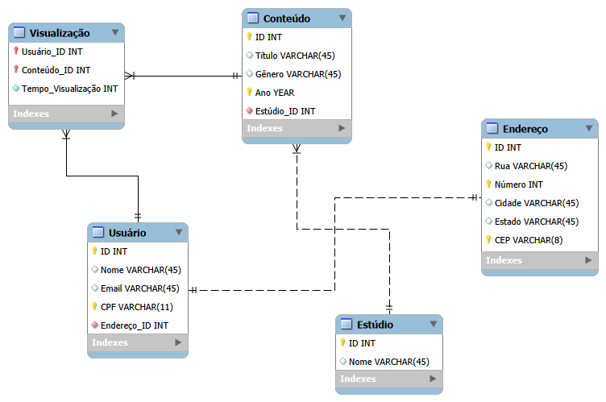
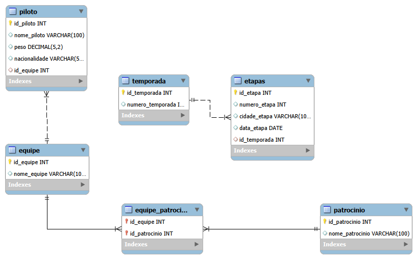

# projetos-tecnico-senac
Repositório com projetos práticos desenvolvidos durante o meu curso Técnico em Desenvolvimento de Sistemas (Senac), com foco em lógica de programação e banco de dados. Este repositório reúne modelagens de banco de dados, scripts SQL completos e aplicações práticas voltadas ao mercado.

### 🚀 Tecnologias utilizadas:
- MySQL
- MySQL Workbench
- SQL (DDL, DML: SELECT, INSERT, UPDATE, DELETE)
- Portugol

### 💻 DISCIPLINA - DESENVOLVER ALGORITMOS:
*Atividades focadas no desenvolvimento do raciocínio lógico usando Portugol.*

* 🎮 **[Loja de Jogos](./portugol-loja-de-jogos.por)**
* 🍽️ **[Sugestão de Pratos](./portugol-sugestao-de-pratos.por)**

---

### 🗄️ DISCIPLINA - AUXILIAR NA MODELAGEM E MANIPULAÇÃO DE BANCO DE DADOS (SQL):
*Projetos de estruturação e consultas em bancos de dados.*

* 🎬 **[Modelagem Streaming](./mysql-modelagem-de-streaming.mwb)** 

**O Desafio:** Atuar como Analista de Dados para estruturar o banco de dados relacional de uma nova plataforma de filmes sob demanda.
  
#### 🔧 Requisitos do Projeto:
- Modelagem de Entidades (Usuário, Endereço, Conteúdo, Estúdio e Visualização).
- Implementação de Regras de Negócio (vínculo obrigatório de endereço, relacionamento 1:N entre estúdio e conteúdo).
- Criação de relacionamento N:N para registro de histórico de visualizações com métricas de tempo.
- Definição de tipos de dados adequados e chaves estrangeiras.

  

---

* 🏎️ **[Gerenciamento de Kart](./criacao.sql)** 

*Sistema relacional para gerenciamento de corridas nacionais de kart, incluindo controle de pilotos, equipes, etapas e patrocinadores.*

#### 🔧 Requisitos do Projeto:
- Criação completa do banco (DDL)
- Inserção de dados da temporada (DML)
- Atualizações de etapas (UPDATE)
- Remoção de patrocinadores (DELETE)

  

---

* 🎮 **[Filtros Avançados TDS Cloud Gaming](./criacaofiltros-queries.sql)** 

*Consultas complexas e filtros estruturados para plataforma de jogos.*

**O Desafio:** Criar filtros de busca avançados para a plataforma TDS Cloud Gaming, aplicando técnicas avançadas de consulta em MySQL como agregações, JOINs e subconsultas.

#### 🔧 Requisitos do Projeto:
- Seleção de registros com filtros temporais e financeiros.
- Uso de funções de agregação para cálculos de média e totais.
- Implementação de junções entre múltiplas tabelas (Usuários, Bibliotecas e Jogos).
- Identificação de valores máximos e filtros por localização geográfica.

### 📊 Habilidades desenvolvidas:
- Modelagem de banco de dados relacional (DER)
- Criação de tabelas com chaves primárias e estrangeiras
- Estruturação de relacionamentos (1:N e N:N)
- Manipulação de dados com SQL (INSERT, UPDATE, DELETE)
- Desenvolvimento de consultas SQL (SELECT)
- Utilização de JOINs (INNER JOIN, LEFT JOIN)
- Aplicação de funções de agregação (AVG, SUM, MAX, COUNT)
- Construção de filtros avançados (WHERE, HAVING)
- Uso de subconsultas para análise de dados
- Análise de dados com base em regras de negócio
- Extração de métricas (preço médio, total de compras, contagem de registros)

---

### 📌 Sobre este repositório
Este repositório reúne projetos desenvolvidos durante a minha formação técnica com foco na aplicação prática de conceitos de lógica de programação, banco de dados e minha na evolução profissional nas áreas de desenvolvimento e análise de dados.
