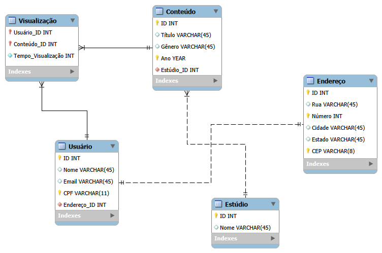
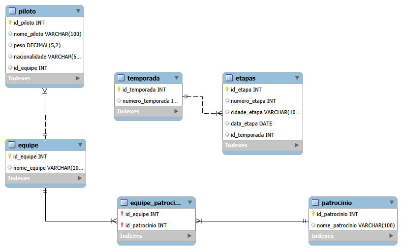
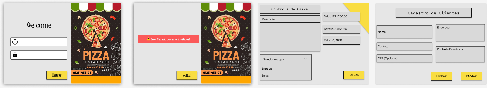

# projetos-tecnico-senac
Repositório com projetos práticos desenvolvidos durante o meu curso Técnico em Desenvolvimento de Sistemas (Senac), com foco em lógica de programação e banco de dados. Este repositório reúne modelagens de banco de dados, scripts SQL completos, UI/UX e aplicações práticas voltadas ao mercado.

### 🚀 Tecnologias utilizadas:
- MySQL
- MySQL Workbench
- SQL (DDL, DML: SELECT, INSERT, UPDATE, DELETE)
- Portugol

### 🗄️ DISCIPLINA - DESENVOLVER ALGORITMOS:
*Atividades focadas no desenvolvimento do raciocínio lógico usando Portugol.*

* 🎮 **[Loja de Jogos](./portugol-logica/portugol-loja-de-jogos.por)**
* 🍽️ **[Sugestão de Pratos](./portugol-logica/portugol-sugestao-de-pratos.por)**

---

### 🗄️ DISCIPLINA - AUXILIAR NA MODELAGEM E MANIPULAÇÃO DE BANCO DE DADOS (SQL):
*Projetos de estruturação e consultas em bancos de dados.*

* 🎬 **[Modelagem Streaming](./banco-de-dados/mysql-modelagem-de-streaming.mwb)** *(arquivo do MySQL Workbench — visualize o diagrama abaixo)*

**O Desafio:** Atuar como Analista de Dados para estruturar o banco de dados relacional de uma nova plataforma de filmes sob demanda.
  
#### 🔧 Requisitos do Projeto:
- Modelagem de Entidades (Usuário, Endereço, Conteúdo, Estúdio e Visualização).
- Implementação de Regras de Negócio (vínculo obrigatório de endereço, relacionamento 1:N entre estúdio e conteúdo).
- Criação de relacionamento N:N para registro de histórico de visualizações com métricas de tempo.
- Definição de tipos de dados adequados e chaves estrangeiras.

  

---

* 🏎️ **[Gerenciamento de Kart](./banco-de-dados/criacao.sql)** 

*Sistema relacional para gerenciamento de corridas nacionais de kart, incluindo controle de pilotos, equipes, etapas e patrocinadores.*

#### 🔧 Requisitos do Projeto:
- Criação completa do banco (DDL)
- Inserção de dados da temporada (DML)
- Atualizações de etapas (UPDATE)
- Remoção de patrocinadores (DELETE)

  

---

* 🎮 **[Filtros Avançados TDS Cloud Gaming](./banco-de-dados/criacaofiltros-queries.sql)** 

*Consultas complexas e filtros estruturados para plataforma de jogos.*

**O Desafio:** Criar filtros de busca avançados para a plataforma TDS Cloud Gaming, aplicando técnicas avançadas de consulta em MySQL como agregações, JOINs e subconsultas.

#### 🔧 Requisitos do Projeto:
- Seleção de registros com filtros temporais e financeiros.
- Uso de funções de agregação para cálculos de média e totais.
- Implementação de junções entre múltiplas tabelas (Usuários, Bibliotecas e Jogos).
- Identificação de valores máximos e filtros por localização geográfica.

### 📊 Habilidades desenvolvidas:
- Modelagem de banco de dados relacional (DER)
- Criação de tabelas com chaves primárias e estrangeiras
- Estruturação de relacionamentos (1:N e N:N)
- Manipulação de dados com SQL (INSERT, UPDATE, DELETE)
- Desenvolvimento de consultas SQL (SELECT)
- Utilização de JOINs (INNER JOIN, LEFT JOIN)
- Aplicação de funções de agregação (AVG, SUM, MAX, COUNT)
- Construção de filtros avançados (WHERE, HAVING)
- Uso de subconsultas para análise de dados
- Análise de dados com base em regras de negócio
- Extração de métricas (preço médio, total de compras, contagem de registros)

---

### 🗄️ PROJETO INTEGRADOR - ASSISTENTE DE DESENVOLVIMENTO DE SISTEMAS:
### OperaSystem - Sistema de Gerenciamento de Assistência Técnica

## 📊 Status do Projeto

🏆 Concluído / Aprovado (Conceito D - Desenvolveu)

## 🎯 Objetivo do Software
O **OperaSystem** é uma aplicação desktop desenvolvida para otimizar e automatizar o fluxo de trabalho de uma assistência técnica. O sistema visa centralizar o controle de acessos, o cadastro de clientes e o registro de atendimentos, substituindo processos manuais por uma solução segura, rápida e integrada a um banco de dados relacional.

## ⚙️ Funcionalidades do Sistema (Requisitos)
* **Controle de Acesso (Login):** Autenticação segura de usuários cadastrados no banco de dados para proteção das informações do sistema.
* **Cadastro de Clientes:** Tela intuitiva para inserção, validação e persistência de dados de clientes (Nome, CPF/CNPJ, Telefone e E-mail) diretamente no banco de dados.
* **Navegação de Fluxo:** Transição fluida entre as telas de Login, Cadastro de Clientes e Registro de Atendimentos.
* **Persistência de Dados:** Integração completa para salvar, ler e estruturar informações em tempo real.

## 🛠️ Tecnologias Aplicadas
Considerando apenas as tecnologias abordadas ao longo deste módulo:
* **Java SE (Standard Edition):** Linguagem de programação principal utilizada no desenvolvimento do sistema.
* **Java Swing:** Framework utilizado para a criação e design das interfaces gráficas (GUI).
* **MySQL Database:** Banco de dados relacional utilizado para persistência dos dados.
* **JDBC (Java Database Connectivity):** API de conexão e o driver `mysql-connector-j` para comunicação entre a aplicação Java e o banco MySQL.

### 🎨 Interface e Protótipo (UX/UI)
O design visual e a experiência do usuário (UX/UI) foram planejados e estruturados no Figma antes da implementação do código, garantindo usabilidade e um fluxo intuitivo para o sistema.

* 🔗 **[Acessar Protótipo Interativo no Figma](https://www.figma.com/design/TCXw1lDy9cpMJhPA3vOeSt/Projeto-Senac?node-id=0-1&t=TeG09WXOQ9h5vedS-1)**

* ⚙️ **[Projeto OperaSystem](./OperaSystem%20Interfaces)**

## 👥 Time de Desenvolvedores
* **Thays Estefhany Reis França** - Desenvolvedora do Sistema
  
---

### 🗄️ DISCIPLINA - AUXILIAR NA ADMINISTRAÇÃO DE BANCO DE DADOS:
Realização de testes de segurança e elaboração de um plano de backup em um banco de dados de teste, simulando uma versão simplificada do sistema final.

A atividade teve como objetivo aplicar procedimentos de exportação e backup de dados, além da criação e gerenciamento de usuários com diferentes níveis de permissão no banco de dados.

## Atividades realizadas

💾 **Exportação de dados**

- Exportação individual das tabelas do banco de dados;
- Exportação completa do banco de dados;
- Execução dos procedimentos de backup utilizando o MySQL Workbench;
- Registro das etapas por meio de capturas de tela.

🔐 **Gestão de usuários e permissões**

- Criação de usuário com permissões completas de CRUD (CREATE, READ, UPDATE e DELETE);
- Criação de usuário com permissão somente para consulta;
- Aplicação e teste das permissões de acesso.

📂 Projetos

📄 [Relatório - Backup e Segurança](./banco-de-dados/relatorio-backup-e-criacao-de-usuarios.pdf)

💻 [Script SQL](./banco-de-dados/script-criacao-insercao.sql)

---

### 🗄️ DISCIPLINA - Desenvolver Projeto de Interface para Melhor Experiência do Usuário:

###Sistema Desktop - Pizzaria do Sr. Manoel (Protótipo UI/UX)

Protótipo de alta fidelidade desenvolvido no Figma para um sistema desktop 
de gestão de uma pizzaria, contemplando login, controle de caixa e 
cadastro de clientes.

## 🎯 Sobre o Projeto

Projeto desenvolvido como parte da disciplina de UI/UX com foco em criar uma navegação fluida 
entre telas e uma experiência de usuário agradável.

## 🖥️ Telas Desenvolvidas

- **Login** — tela de autenticação do sistema.
- **Tela de erro** — feedback visual de usuário/senha inválidos.
- **Controle de Caixa** — registro de entradas e saídas financeiras.
- **Cadastro de Clientes** — formulário de cadastro com dados de contato.

## 🎨 Protótipo Interativo

[Acesse o Protótipo Navegável no Figma](https://www.figma.com/proto/QjyoQaU6qb7vhImM8xqcKZ/Wireframes-Pizzaria?node-id=34-478&p=f&t=ybuqKkQgu0wA8tHJ-1&scaling=min-zoom&content-scaling=fixed&page-id=0%3A1)

## 📄 Todas as telas do wireframe

  

## 🛠️ Ferramentas Utilizadas

- Figma (prototipação e design UI/UX)

## 📌 Status

✅ Projeto entregue e avaliado — feedback: "Wireframes bem desenvolvidos 
e navegação válida."
